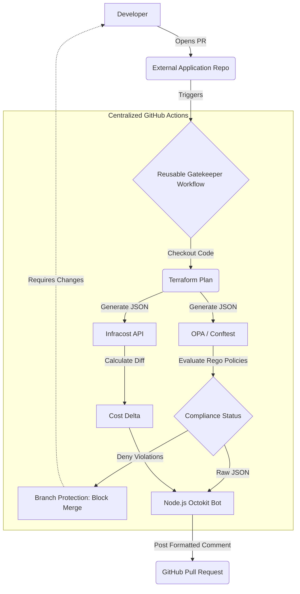
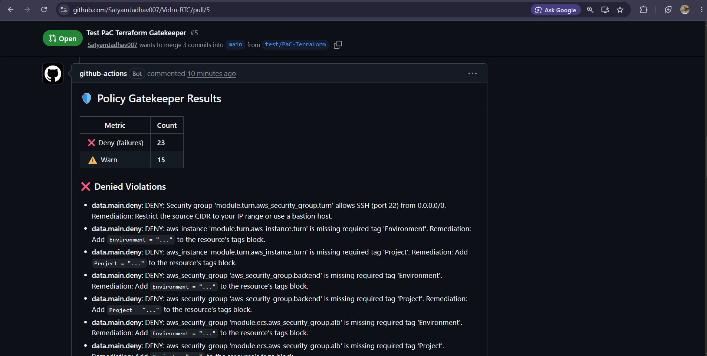
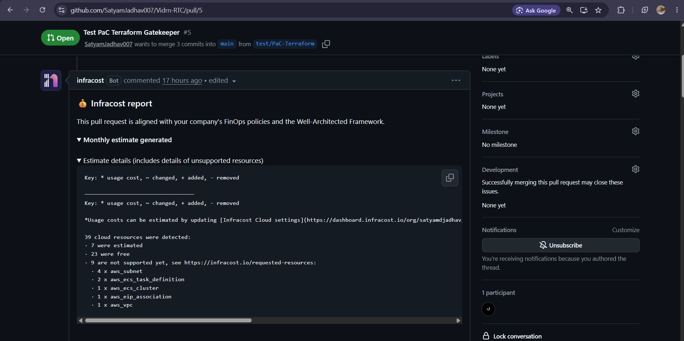
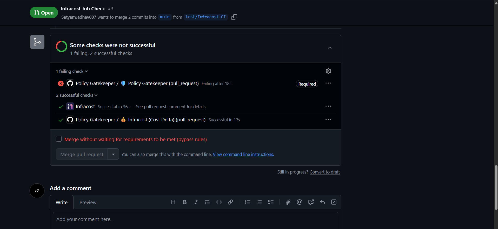

# PaC-Gatekeeper-Terraform

**PaC-Gatekeeper-Terraform** is a centralized **Policy as Code (PaC)** platform designed to deeply enforce **Cloud Security**, **FinOps governance**, and **Compliance** across distributed AWS infrastructure, built to understand how **Open Policy Agent (OPA/Rego)**, **Terraform**, **Infracost**, and **GitHub Actions** work together in a production-style ecosystem.
The project emphasizes **shift-left security**, **automated cost visibility**, **centralized governance**, and **developer-friendly UX**, while maintaining a clean, modular architecture. Beyond the policy layer, the Gatekeeper is fully automated via a **Reusable GitHub Actions Workflow**, provisioning a highly intelligent **Node.js + Octokit Bot** to format and inject compliance results directly into Pull Requests. This architecture enables seamless, organization-wide policy enforcement-blocking non-compliant merges at the CI level while delivering contextual remediation steps to developers in real-time.

---

## 🚀 Highlights & Features

- 🛡️ **Centralized Policy as Code (OPA/Rego)**
  - Enforces FinOps (EC2 sizing, tagging) and Security (Encryption, IAM wildcard blocking) rules.
  - Written in **Rego** and evaluated against Terraform JSON plans using **Conftest**.
  - **60/60 passing unit tests** ensuring 98.5% policy coverage before execution.

- 💰 **Automated Cost Estimation (Infracost)**
  - Calculates the exact cost delta (increase/decrease) of proposed infrastructure changes.
  - Evaluates changes automatically via the `infracost/actions/diff` GitHub Action.
  - Posts a dedicated cost summary directly into the PR context.

- 🤖 **Custom PR Comment Bot (Node.js & Octokit)**
  - Parses raw `results.json` output from Conftest.
  - Formats results into a clean, easy-to-read Markdown table grouped by severity (❌ Deny, ⚠️ Warn).
  - Uses hidden HTML signatures (`<!-- gatekeeper-comment-id -->`) to implement **idempotent updates**, avoiding PR comment spam on new commits.

- 🧱 **Reusable Workflow Architecture**
  - Designed as a centralized `workflow_call` action (`reusable-policy-gatekeeper.yml`).
  - Seamlessly checks out external caller repositories (like application codebases) alongside central security policies.
  - Allows organizational scaling without copy-pasting `.github` configurations across multiple repos.

- 🔐 **Secure State & Secret Injection**
  - Authenticates with real **AWS S3 Backends** during the CI pipeline to generate accurate, state-aware Terraform plans.
  - Secures variable injection utilizing **Bash Heredocs** to pass complex, multiline `TF_VARS` without quoting corruption.

- 🛑 **Branch Protection & True Enforcement**
  - Integrated directly into GitHub Repository settings as a mandatory Status Check.
  - Physically disables the "Merge pull request" button if any `Deny` violations are detected.
  - Fails open on warnings to allow best-practice recommendations without blocking deployments.

- ⚡ **Modern Tech Stack**
  - **Infrastructure as Code:** Terraform, HCL
  - **Policy Engine:** Open Policy Agent (OPA), Rego, Conftest
  - **CI/CD:** GitHub Actions (Reusable Workflows)
  - **Scripting & Bot:** Node.js, GitHub Octokit, JavaScript
  - **FinOps:** Infracost API

---

## 🧠 Architecture Overview



- **Open Policy Agent (OPA/Rego)** handles the static analysis of the Terraform Plan JSON.
- **Conftest** acts as the test runner, mapping the `.rego` policies against the compiled infrastructure state.
- **GitHub Actions (Reusable Workflows)** is used for:
  - Checking out cross-repository code (Infrastructure + Policies).
  - Setting up Terraform and initializing remote S3 backends.
  - Parallelizing the execution of Policy Checks and Cost Estimation.
- **Node.js (Octokit)** is used as a formatting layer to parse raw JSON violation data into developer-friendly markdown and push it to the GitHub API.
- **Infracost** serves as the FinOps engine to fetch real-time AWS pricing data and calculate monthly cost differences based on the Terraform plan.
- **GitHub Branch Protection Rules** serve as the final physical barrier, ensuring code cannot reach the `main` branch unless it satisfies the Central Gatekeeper's conditions.

---

## 📸 Proof of Concept (Screenshots)

_Below is the Gatekeeper successfully blocking an external repository's non-compliant infrastructure changes._

### The Custom PR Comment



### Cost Visibility Integration



### Hard Enforcement (Blocked Merge)



---

## 🧪 Environment Setup & Running the Application

There are two primary ways to interact with this project: testing the policies locally, or integrating the Gatekeeper into your own repository.

### 1. Local Development (Policy Testing)

The easiest way to test and write new Rego policies locally against the synthetic demo infrastructure.

1. Clone the repository:

```bash
git clone https://github.com/SatyamJadhav007/PaC-Gatekeeper-Terraform.git
cd PaC-Gatekeeper-Terraform
```

2. Run the OPA Unit Tests:

```bash
opa test policies/ policies_test/ -v
```

3. Generate a local Terraform plan and test it via Conftest:

```bash
cd demo-terraform
terraform init -backend=false
terraform plan -out=tfplan -input=false
terraform show -json tfplan > plan.json
conftest test plan.json -p ../policies/
```

### 2. Integration via GitHub Actions (External Repositories)

To enforce these policies on an external Terraform repository (e.g., your primary application infrastructure).

1. Create a `.github/workflows/enforce-policies.yml` file in your target repository.
2. Call the Reusable Workflow, passing your backend configuration requirements:

```yaml
name: Enforce Gatekeeper Policies

on:
  pull_request:
    paths:
      - "**.tf"

permissions:
  contents: read
  pull-requests: write

jobs:
  call-gatekeeper:
    uses: SatyamJadhav007/PaC-Gatekeeper-Terraform/.github/workflows/reusable-policy-gatekeeper.yml@main
    with:
      tf_working_dir: "."
      aws_region: "ap-south-1"
    secrets:
      AWS_ACCESS_KEY_ID: ${{ secrets.AWS_ACCESS_KEY_ID }}
      AWS_SECRET_ACCESS_KEY: ${{ secrets.AWS_SECRET_ACCESS_KEY }}
      INFRACOST_API_KEY: ${{ secrets.INFRACOST_API_KEY }}
      TF_VARS_FILE: ${{ secrets.TF_VARS_FILE }}
```

---

## 🎯 Project Goal

The primary goal of **PaC-Gatekeeper-Terraform** is to **deeply understand and implement Cloud Governance at scale**, specifically:

- Writing robust, test-driven Open Policy Agent (Rego) constraints.
- Automating infrastructure static analysis within CI/CD pipelines.
- Injecting FinOps (Cost Estimation) directly into the developer workflow.
- Architecting Reusable GitHub Actions for organization-wide deployment.
- Creating a seamless, non-intrusive Developer Experience (DX) via custom GitHub bots.

While the repository contains synthetic Terraform for demonstration, its core strength lies in its **production-ready, plug-and-play architecture** capable of securing real-world deployments.

---

## 📌 Status

✅ **Completed / Developed** — The core policy engine, bot, and reusable workflow are fully implemented and verified against real production code.

The project remains **open for future improvements**, particularly around adding advanced **drift detection** policies, integrating **Checkov/Trivy** for out-of-the-box vulnerability scanning alongside custom Rego rules, and deploying automated Slack alerts for blocked high-risk deployments.

---

Feel free to explore, fork, and experiment with Policy as Code patterns using **PaC-Gatekeeper-Terraform**.

**Thanks For Reading** 😊
